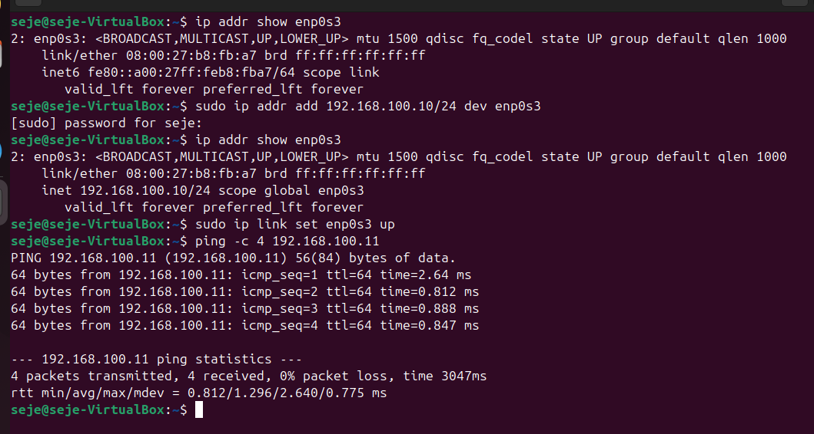
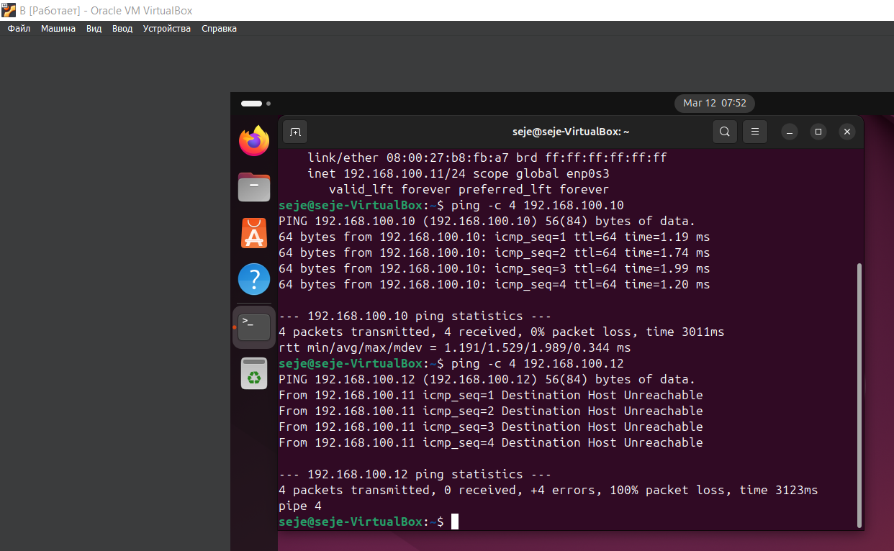
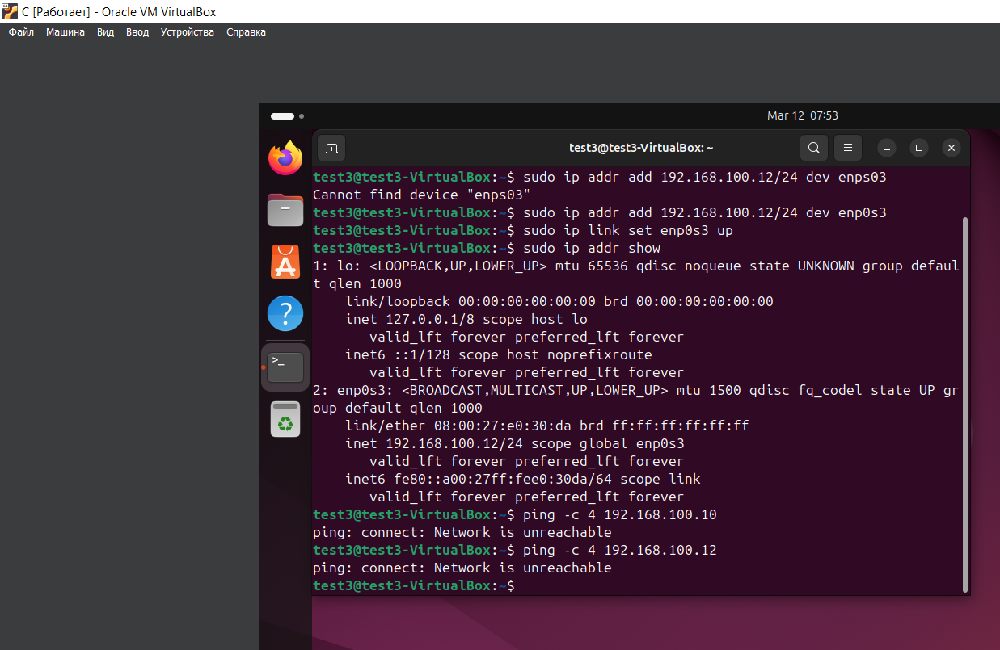
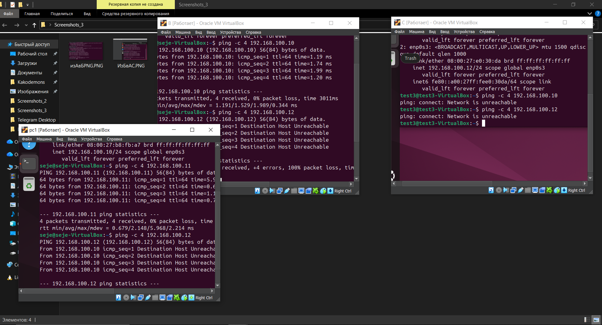

# Лабораторная работа 3

Студент: [Малышев Сергей Александрович]  
Группа: [K3339]  
Дата: [09.03.2026]

## Цель работы
Необходимо настроить виртуальную машину А с Ubuntu (желательно, но можно и другую Linux подобную ОС) в VirtualBox. Обеспечить доступ в сеть Интернет. Осуществить проверку этого доступа и приложить скриншот из терминала. Следующим шагом настроить ещё одну виртуальную машину Б. После чего обеспечить сетевой доступ от машины А к машину Б. Приложить скриншот из терминала. Поднять ещё одну виртуальную машину В. Организовать сетевой доступ:

1. из машины А в машину Б,
2. из машины А в машину В,
3. но запретить доступ из машины Б в машину В,
4. приложить скриншот, на котором видно терминалы всех трёх машин и видно что между машинами есть (или нет) доступа.

## Ход работы

### 1. Установка окружения
- ОС: Windows 11 + WSL 2 (Ubuntu)
- Команда установки: wsl --install -d Ubuntu
- После перезагрузки задал имя пользователя и пароль


### 2. Подготовка системы
```
sudo ip addr add 192.168.100.xx/24 dev enp0s3
sudo ip route add 192.168.100.0/24 dev enp0s3
sudo ip link set enp0s3 up
```
```
sudo apt update
sudo apt install ufw -y
sudo ufw enable
sudo ufw deny from 192.168.100.11   # IP машины Б
sudo ufw reload
```

### 3. Пинг из А в Б
<p align="center">
  
  <br><br>
  <em>Из A в Б</em>
</p>

### 4. Пинг из Б в А и С
```
if [ $# -eq 0 ]; then
    echo "Welcome to ITMO University"
else
    echo "Welcome, $*"
fi
```

<p align="center">
  
  <br><br>
  <em>из Б в А и С</em>
</p>

### 5. Пинг из С в А и Б
<p align="center">
  
  <br><br>
  <em>Из С</em>
</p>

### 6. Общий скрин
<p align="center">
  
  <br><br>
  <em>Общий скрин</em>
</p>
